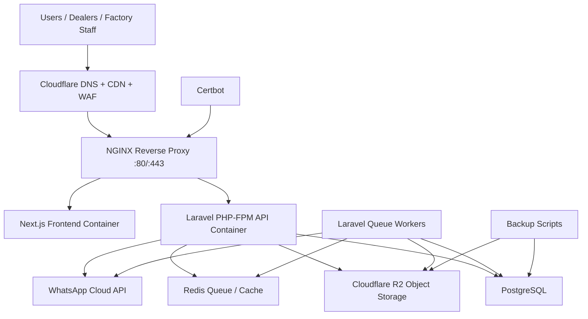

# Production Deployment Architecture

This deployment design targets Hetzner or DigitalOcean with Docker, NGINX, PostgreSQL, Redis, Cloudflare R2, GitHub Actions CI/CD, SSL, backups, and a scalable path from one server to multiple nodes.

## Subdomains

```text
www.theduel.in       Public website and product catalog
app.theduel.in       Customer dashboard
dealer.theduel.in    Dealer portal
erp.theduel.in       ERP/admin frontend
api.theduel.in       Laravel ERP API
assets.theduel.in    Cloudflare R2 custom domain
```

In this first deployment, the Next.js app serves `www`, `app`, `dealer`, and `erp` routes from one frontend container. Later, these can be split into separate frontend apps behind the same NGINX layer.

## Infrastructure Diagram



## Files Added

```text
docker-compose.prod.yml
docker/frontend/Dockerfile
docker/backend/Dockerfile
docker/backend/php.ini
docker/backend/supervisord.conf
docker/nginx/nginx.conf
docker/nginx/conf.d/theduel.conf
docker/nginx/conf.d/theduel.http.conf.example
scripts/deploy.sh
scripts/init-ssl.sh
scripts/renew-ssl.sh
scripts/backup-postgres.sh
scripts/restore-postgres.sh
scripts/server-bootstrap-ubuntu.sh
.github/workflows/deploy.yml
.env.production.example
.env.frontend.example
.env.backend.example
```

## Recommended Server Specs

### MVP Production

Use this for launch and early paid traffic.

```text
Provider: Hetzner CPX31/CPX41 or DigitalOcean Premium Droplet
CPU: 4 vCPU
RAM: 8 GB
Disk: 160 GB NVMe
OS: Ubuntu 24.04 LTS
Containers: NGINX, Next.js, Laravel, queue, PostgreSQL, Redis
Backups: daily database dump + provider snapshot
```

### Growing Production

Use this when order volume, uploaded artwork, and ERP usage increase.

```text
Web/API server: 4-8 vCPU, 8-16 GB RAM
Database server: managed PostgreSQL or dedicated 4 vCPU, 16 GB RAM
Redis: managed Redis or dedicated small VM
Storage: Cloudflare R2 only, no local artwork storage
Backups: daily logical dump + WAL/PITR if managed database supports it
```

### High Availability

Use this once downtime has direct factory impact.

```text
Load balancer: Cloudflare + provider load balancer
Frontend/API nodes: 2+ Docker hosts
Database: managed PostgreSQL with standby/PITR
Redis: managed Redis
Queue workers: horizontally scaled
Assets: Cloudflare R2
Logs/monitoring: Sentry + Better Stack + uptime checks
```

## Docker Topology

```text
nginx
- Public edge container
- Terminates SSL
- Routes frontend subdomains to Next.js
- Routes api.theduel.in to Laravel PHP-FPM

frontend
- Next.js standalone build
- Serves public website, customer dashboard, dealer portal, ERP frontend

backend
- Laravel PHP-FPM
- Handles API requests

queue
- Laravel queue workers
- Laravel scheduler
- WhatsApp, notifications, image jobs, reports

postgres
- Primary database
- Use managed PostgreSQL when budget allows

redis
- Queue, cache, sessions

certbot
- Let's Encrypt certificate issue/renewal
```

## Initial Deployment Steps

```bash
# On fresh Ubuntu server as root
sh scripts/server-bootstrap-ubuntu.sh

# Clone repo
mkdir -p /opt/theduel
cd /opt/theduel
git clone git@github.com:your-org/theduel.git .

# Create env files
cp .env.production.example .env
cp .env.frontend.example .env.frontend
cp .env.backend.example .env.backend

# Edit all secrets
nano .env
nano .env.frontend
nano .env.backend

# First SSL issue
LETSENCRYPT_EMAIL=admin@theduel.in sh scripts/init-ssl.sh

# Deploy
sh scripts/deploy.sh
```

## SSL

Use Let's Encrypt through Certbot.

First-time SSL requires the HTTP-only bootstrap config:

```text
docker/nginx/conf.d/theduel.http.conf.example
```

After certificates are issued, `scripts/init-ssl.sh` restores the SSL NGINX config and reloads NGINX.

Renewal:

```bash
sh scripts/renew-ssl.sh
```

Recommended cron:

```text
0 3 * * * cd /opt/theduel && sh scripts/renew-ssl.sh >> /var/log/theduel-ssl-renew.log 2>&1
```

## CI/CD

GitHub Actions workflow:

```text
.github/workflows/deploy.yml
```

Required repository secrets:

```text
PRODUCTION_HOST
PRODUCTION_USER
PRODUCTION_SSH_KEY
PRODUCTION_SSH_PORT
```

Deployment flow:

```text
push to main
GitHub Actions SSH into server
scripts/deploy.sh
git pull
docker compose build
docker compose up -d
Laravel migrations/cache
NGINX reload
Docker prune
```

## Backups

PostgreSQL logical backup:

```bash
sh scripts/backup-postgres.sh
```

Restore:

```bash
sh scripts/restore-postgres.sh backups/postgres/theduel_YYYYMMDD_HHMMSS.dump.gz
```

Recommended backup policy:

```text
Hourly: provider snapshot or managed PostgreSQL PITR if available
Daily: pg_dump custom format
Weekly: encrypted offsite backup
Retention: 7 daily, 4 weekly, 6 monthly
Restore test: monthly
```

For Cloudflare R2:

```text
- Enable bucket lifecycle/versioning where appropriate.
- Keep all artwork, invoices, previews, and job cards in R2.
- Do not store production assets only on the server disk.
```

## Security

```text
- Use Cloudflare DNS proxy and WAF.
- Keep SSH key-only authentication.
- Disable root SSH login after creating a deploy user.
- Enable UFW for only 22, 80, 443.
- Use fail2ban and unattended security upgrades.
- Store secrets only in env files or CI secrets.
- Never commit production .env files.
- Use strong POSTGRES_PASSWORD and APP_KEY.
- Restrict PostgreSQL/Redis to internal Docker network.
- Run containers as non-root where practical.
- Keep Laravel APP_DEBUG=false.
- Use secure, HTTP-only cookies for auth.
- Rate-limit login, OTP, webhook, and upload endpoints.
- Validate Cloudflare R2 signed uploads in Laravel.
- Verify WhatsApp webhook signatures.
```

## Scalability Path

### Phase 1: Single Server

```text
One VM runs all containers.
Good for launch and controlled order volume.
```

### Phase 2: Split Database

```text
Move PostgreSQL to managed database.
Keep app, queue, NGINX, Redis on app server.
```

### Phase 3: Split Workers

```text
Run separate worker VM for queues, WhatsApp, reports, image processing.
Scale queue replicas independently.
```

### Phase 4: Multiple App Nodes

```text
Use provider load balancer or Cloudflare Tunnel/load balancing.
Run multiple frontend/backend hosts.
Use shared R2 storage and managed Redis/PostgreSQL.
```

## NGINX Notes

The provided NGINX config:

```text
www.theduel.in, theduel.in, app.theduel.in, dealer.theduel.in, erp.theduel.in -> frontend:3000
api.theduel.in -> Laravel PHP-FPM
```

If ERP, dealer, and app become separate Next.js apps later, create separate upstreams:

```text
customer_frontend
dealer_frontend
erp_frontend
marketing_frontend
```

## Hetzner vs DigitalOcean

```text
Hetzner:
- Better price/performance
- Excellent for cost-efficient production
- More manual ops responsibility

DigitalOcean:
- Easier managed database/add-ons
- Simpler team onboarding
- Higher cost for equivalent compute
```

Recommended:

```text
Start with Hetzner if you are comfortable operating Docker/Linux.
Start with DigitalOcean if managed services and simpler ops matter more than raw cost.
```
